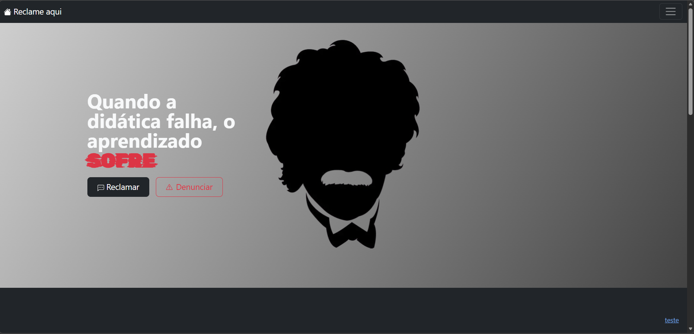

# 🗣️ Reclame Aqui dos Professores

Plataforma web inspirada no Reclame Aqui, voltada para avaliações e feedbacks sobre professores. O objetivo é permitir que alunos compartilhem experiências de forma anônima, promovendo transparência e melhorias no ambiente educacional.

---

## 📸 Preview



---

## 🚀 Tecnologias utilizadas

- HTML5
- CSS3
- Bootstrap 5
- Google Fonts

---

## ⚙️ Funcionalidades

- Sistema de navegação responsivo (Navbar + Offcanvas)
- Seção de reclamações e denúncias
- Layout moderno com animações em gradiente
- Estrutura de planos (gratuito, pro e pro max)
- Feedbacks anônimos
- Design adaptado para diferentes dispositivos

---

## 📂 Como executar o projeto

1. Clone o repositório:
```bash
git clone https://github.com/LucasMarques559/Reclame-Aqui.git
